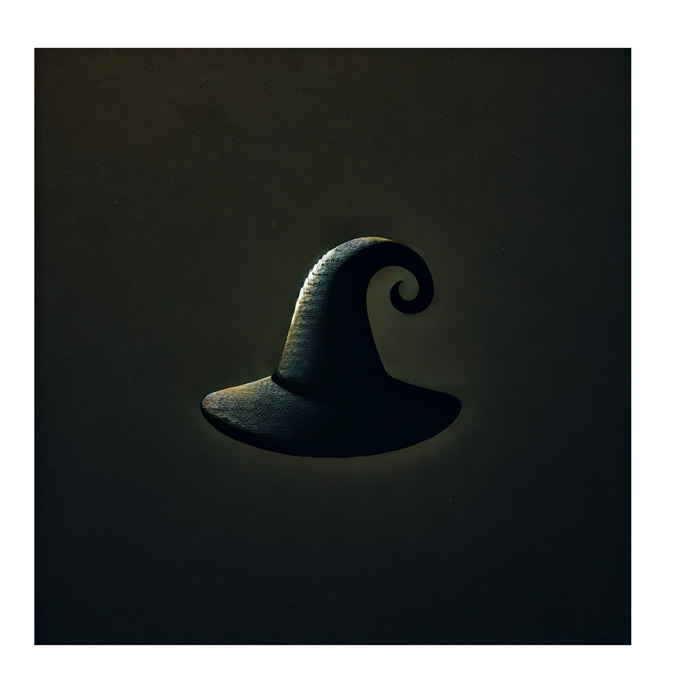

# villin_REIGN




<div align="center">

[](https://www.rust-lang.org)[](#license)[](#security)

🚧 Work in Progress 🚧

**This project is in an early stage of development and is not ready for production use. Breaking changes are likely, and documentation may be incomplete. Use at your own risk! Contributions and feedback are welcome.**

</div>

## Mission Statement

villin_REIGN empowers military and defense organizations with a secure, reliable, and efficient framework for protecting Internet of Battlefield Things (IoBT) communications, ensuring operational integrity while minimizing cybersecurity vulnerabilities in mission-critical environments.

## Core Capabilities

- **Military-Grade Security**: Zero-trust architecture with advanced encryption
- **Protocol Sovereignty**: Command over multi-protocol battlefield communications
- **Real-Time Protection**: Instant threat detection and response
- **Resource Efficiency**: Optimized for battlefield deployment
- **Compliance Ready**: Built for military security standards

## Technical Foundation

```rust
pub struct REIGN_CORE {
    encryption: MilitaryGradeEncryption,
    authentication: ZeroTrustAuth,
    monitoring: RealTimeThreatDetection,
}

impl REIGN_CORE {
    pub fn new() -> Result<Self, SecurityError> {
        // Implementation with military-grade security
    }
}
```

## Deployment Hierarchy

```
REIGN_SOVEREIGN
└── Core Security
    ├── Encryption Module
    ├── Authentication Layer
    └── Threat Monitoring
```

## Performance Metrics

| Capability       | Performance   |
| ---------------- | ------------- |
| Encryption Speed | < 1ms latency |
| Threat Detection | Real-time     |
| Protocol Support | Military-spec |
| Security Level   | Zero-trust    |

## Implementation

```bash
# Clone repository
git clone https://github.com/your-username/villin_REIGN.git

# Build with cargo
cargo build --release

# Run tests
cargo test
```

## Security Commitment

villin_REIGN maintains unwavering dedication to:

- Zero-trust security architecture
- Military compliance standards
- Real-time threat monitoring
- Secure communication protocols

## Development Status

Currently in active development with planned phases:

- [X] Core Architecture Design
- [ ] Security Implementation
- [ ] Protocol Integration
- [ ] Military Compliance
- [ ] Performance Optimization

## Strategic Advantages

- Built in Rust for maximum security and performance
- Military-focused design principles
- Comprehensive threat protection
- Battlefield-ready deployment
- Cross-platform compatibility

## Documentation

Comprehensive documentation available in the `/docs` directory:

- Security Architecture
- Implementation Guide
- API Reference
- Deployment Strategies
- Compliance Documentation

## Contribution Guidelines

Contributions are subject to strict security reviews. See [CONTRIBUTING.md](./docs/CONTRIBUTING.md) for detailed guidelines.

## Security

For security concerns, please review our [SECURITY.md](./docs/SECURITY.md) document.

## License

This software is subject to military use licensing. Contact for licensing details.

## Contact

For official inquiries regarding military implementation and licensing:

- [Contact Information]

---

<div align="center">
<strong>villin_REIGN</strong><br>
Securing the Future of Military IoT
</div>
